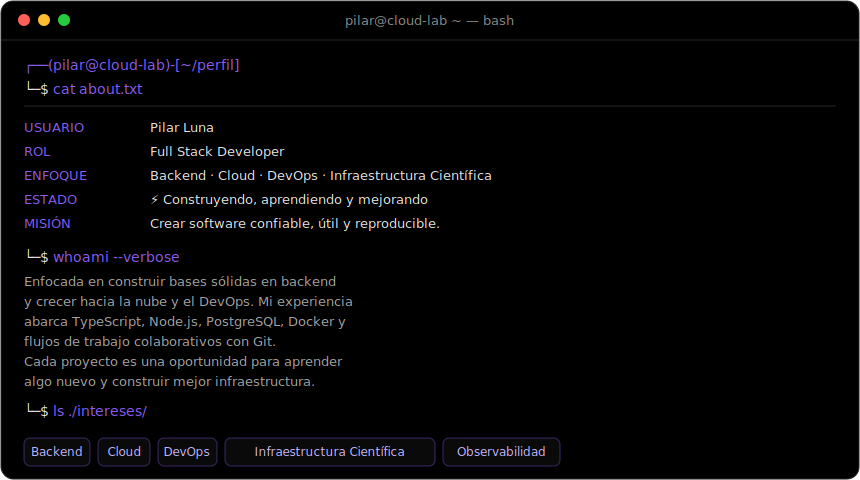
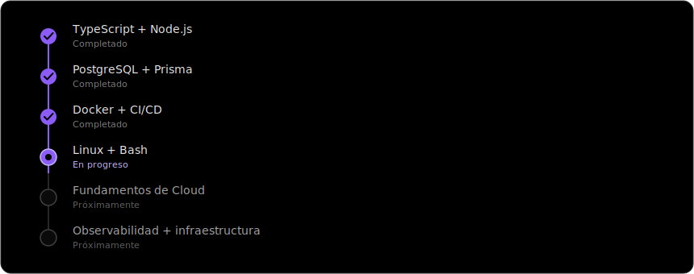
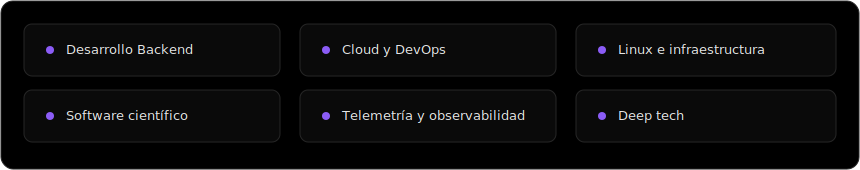

<h1 align="center">Pilar Luna ✦</h1>

   

  Construyendo software, automatización y plataformas confiables para sistemas científicos y de alto impacto.

 

  

---

##  Sobre mí

Soy Pilar, estudiante de Programación de Argentina. Hoy estoy construyendo experiencia real como desarrolladora full stack, trabajando con TypeScript, Node.js, PostgreSQL, Docker y proyectos colaborativos.

Me interesan especialmente el backend, Cloud/DevOps, Linux y los sistemas técnicos con impacto real. A futuro me gustaría aportar en plataformas científicas, telemetría, observabilidad e infraestructura para proyectos de investigación o tecnología avanzada.

---

##  Ruta de aprendizaje

  

---

##  Stack tecnológico

### Desarrollo

  
  
  
  
  
  

### Web y Backend

  
  
  
  
  
  

### Herramientas e infraestructura

  
  
  
  
  
  

---

##  Intereses

  

---

##  Estadísticas

  

  

---

##  Contacto

  
  

